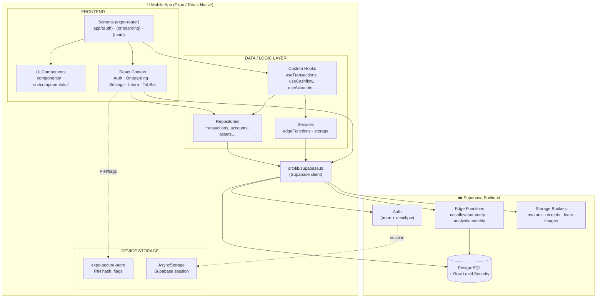
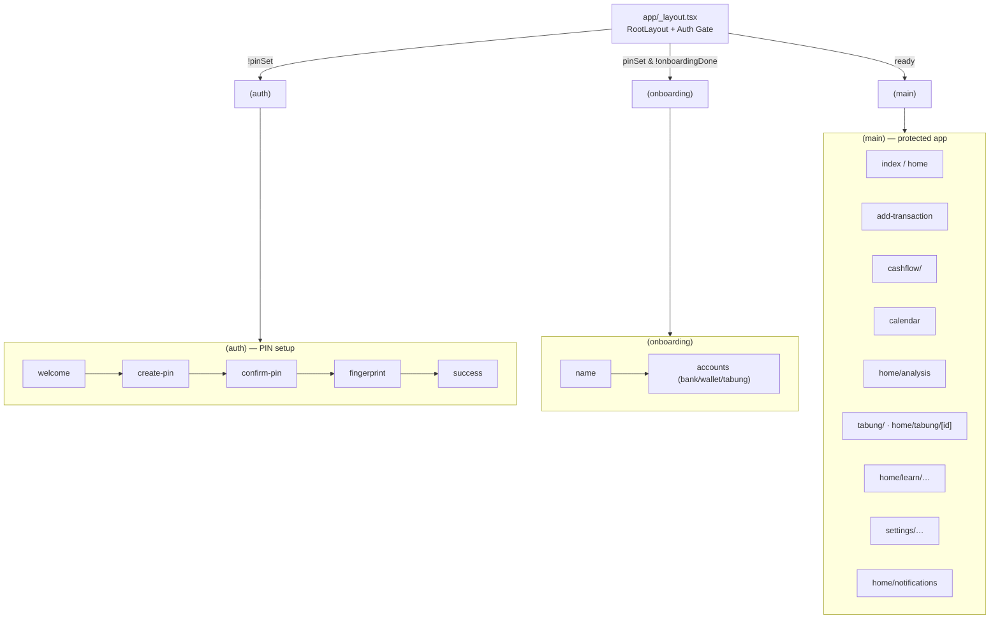
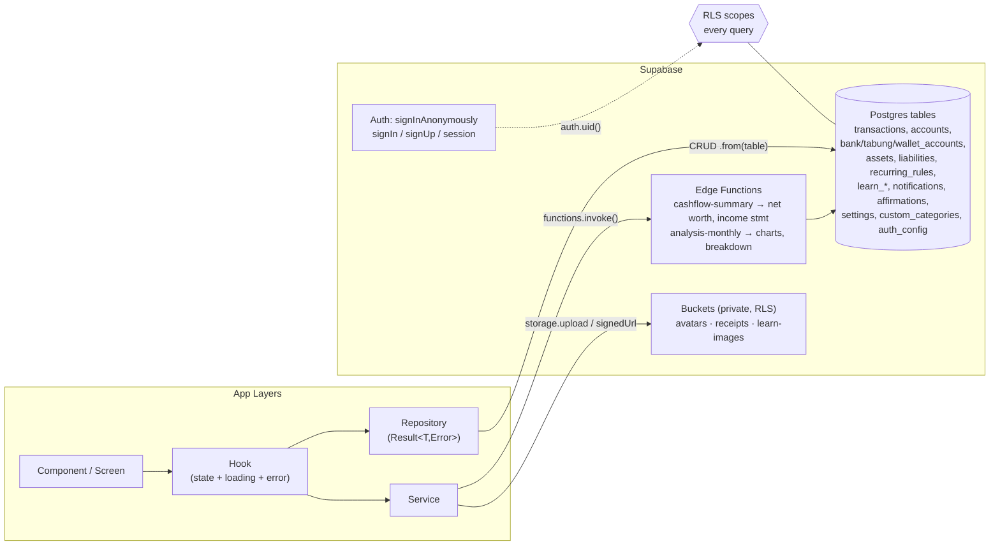

# Flowe — Architecture

Flowe is an Expo (React Native) personal finance app with a Supabase backend (Auth, PostgreSQL + RLS, Edge Functions, Storage). The client follows strict layering: **Screen → Hook → Repository/Service → Supabase client**. Components never touch Supabase directly.

## 1. High-Level System Architecture

## 2. Frontend — Routing & Auth Gate

## 3. Backend / API — Data Flow & Layering

## Key architectural notes

- **Strict layering:** Screen → Hook → Repository/Service → `supabase` client (`src/lib/supabase.ts`). Components never call Supabase directly.
- **Result pattern:** repositories/services return `Result<T, Error>` instead of throwing; hooks unwrap into `{ data, loading, error }` (e.g. `src/hooks/useTransactions.ts`).
- **API surface = 2 kinds:** direct table CRUD via PostgREST (repositories) + 2 Edge Functions for computed aggregates (`src/services/edgeFunctions.ts`).
- **Security:** all DB access is RLS-scoped to `auth.uid()`; private buckets use time-limited signed URLs (`src/services/storage.ts`). Local PIN hash + flags live in `expo-secure-store`; the Supabase session is persisted in `AsyncStorage`.
- **Auth gate** in `app/_layout.tsx` drives three route groups: `(auth)` PIN setup → `(onboarding)` → `(main)`, with anonymous sign-in as the default session.
