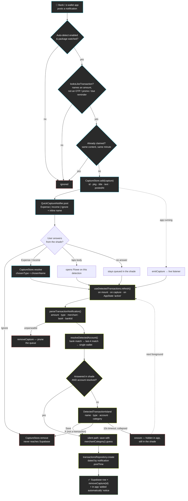
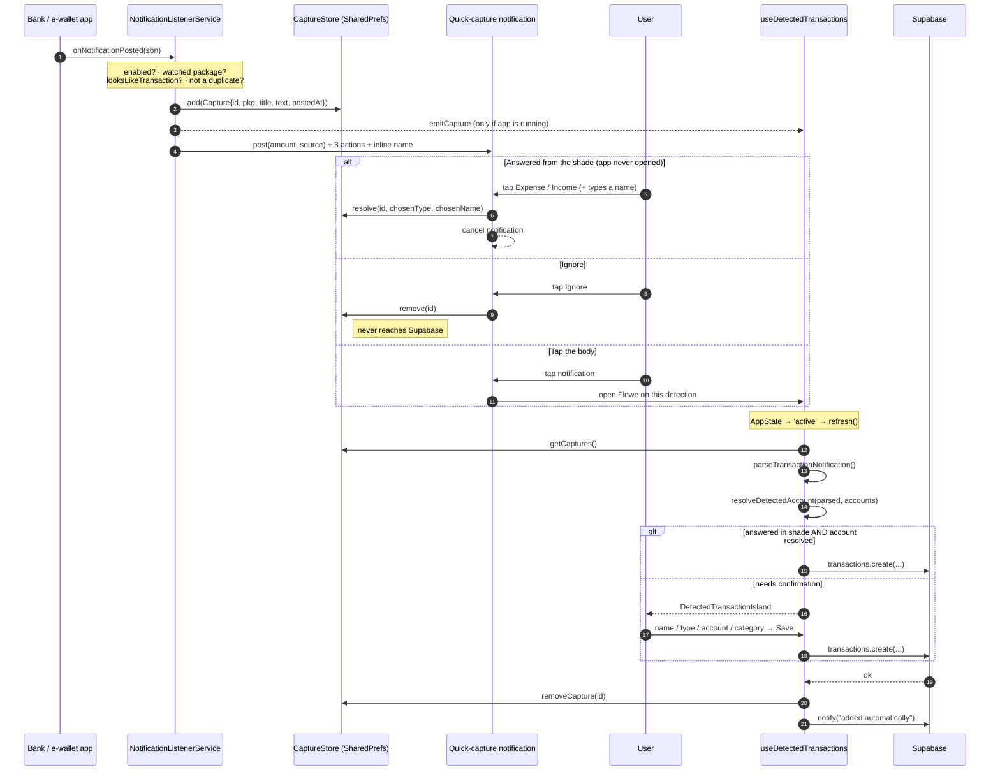
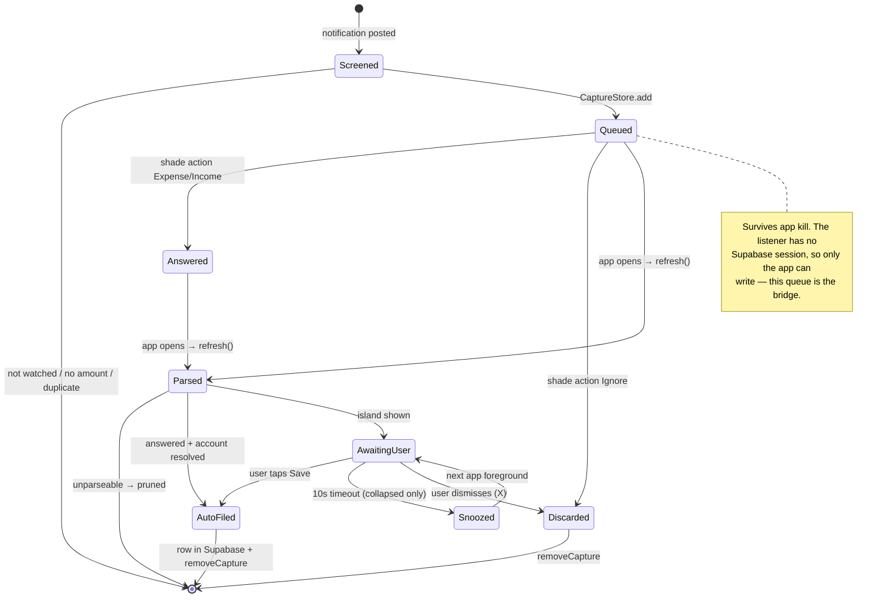
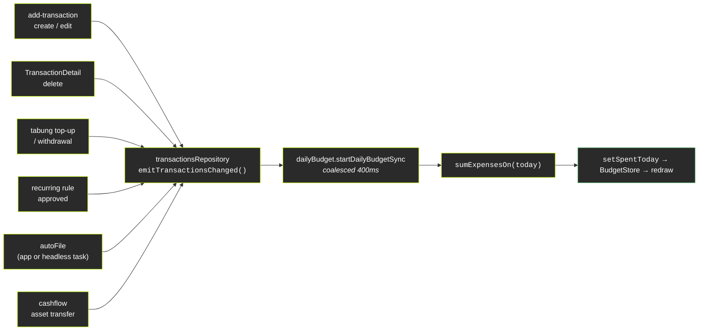
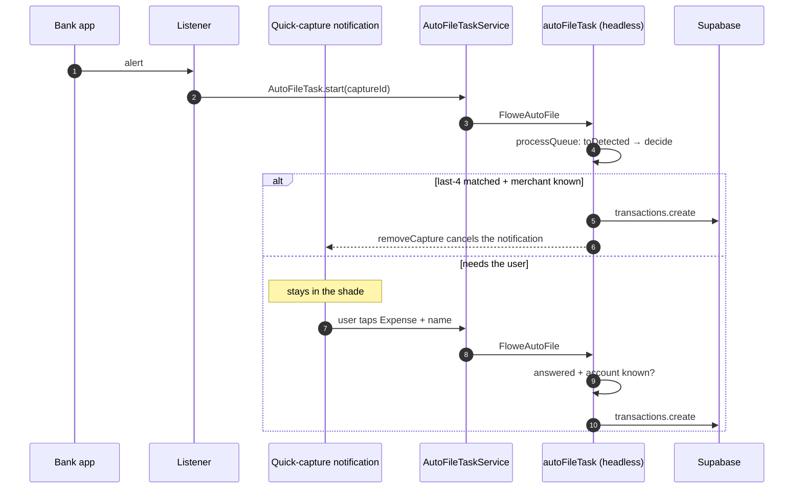
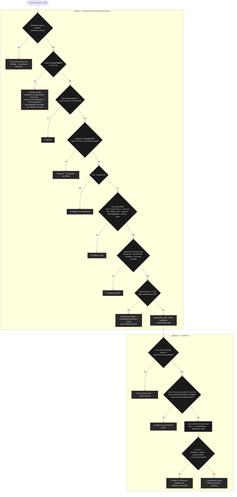

# Flowe — Outside-App Transaction Detection

How a payment made **outside Flowe** (a bank or e-wallet app notification) becomes a
transaction row, with or without the user ever opening the app.

**Android only.** iOS gives no app a way to read another app's notifications, so
`FloweNotifications.isAvailable` is `false` there and the whole flow is inert.

| Piece | Where |
|---|---|
| Notification listener service | `modules/flowe-notifications/android/.../TransactionNotificationListenerService.kt` |
| Notification text extraction | `.../NotificationText.kt` |
| On-device capture queue | `.../CaptureStore.kt` |
| Quick-capture notification + actions | `.../QuickCaptureNotifier.kt`, `.../QuickCaptureReceiver.kt` |
| JS bridge | `modules/flowe-notifications/index.ts` |
| Orchestration hook | `src/hooks/useDetectedTransactions.ts` |
| Parsing / matching | `src/utils/parseTransactionNotification.ts`, `src/utils/resolveDetectedAccount.ts` |
| Account matching rules | `src/utils/accountMatching.ts` (shared by the resolver and the settings screen) |
| In-app confirm UI | `components/home/DetectedTransactionIsland.tsx` |
| Watched apps | `constants/notificationSources.ts` |
| Settings screen | `app/(main)/settings/auto-detect.tsx` |

## 1. Flow Overview

## 2. End-to-End Sequence

## 3. Lifecycle of One Capture

## Design Notes

- **The queue is the bridge.** The listener service runs with no signed-in Supabase
  session, so captures live in `SharedPreferences` until the app next runs and flushes
  them. Nothing is lost if the phone reboots or Flowe is force-stopped.
- **Loose native screen, authoritative JS parse.** Kotlin asks two things: is there a
  ringgit amount, and is this a security code or a piece of marketing? It deliberately does
  *not* insist the text say money moved — banks word a payment a dozen ways ("Transaction
  Alert: RM 20.00 at ZUS", "DuitNow QR successful"), and every verb the screen required was
  an alert some bank never sent. Type, merchant, last-4 and bank all come from
  `parseTransactionNotification.ts`, which is a pure function, unit-tested, and updatable
  via OTA without a native rebuild — so the native list stays the looser of the two. The
  parser accepts direction-neutral wording as an *unconfident* expense (the card asks,
  auto-save refuses), strips the "Available balance RM …" trailer before reading the
  amount, and skips its own heuristics entirely for a capture the user already answered
  from the shade.
- **Staying bound is the hard part.** Android drops a `NotificationListenerService`'s
  binding after an app update, a crash or a force-stop and does not reliably bind it again,
  even though "Notification access" stays granted — from the user's side, alerts simply
  stop being read. Three things counter that: `onListenerDisconnected` immediately calls
  `requestRebind`; `ensureBound` runs on every app start and foreground (module `OnCreate`,
  `useDetectedTransactions.refresh`, the Auto-detect screen) and, if the listener isn't
  connected, toggles the component off/on to force the system to rebind it; and
  `onListenerConnected` re-reads the whole shade, so anything a watched app posted during
  the gap is captured then. Settings → Auto-detect shows "granted, but not connected" while
  that is the case. The whole `onNotificationPosted` path is wrapped so a single unreadable
  notification (foreign Parcelables in `extras`) can never crash the process and unbind it.
- **Every notification style is read.** `NotificationText` pulls text from `EXTRA_TEXT`,
  `EXTRA_BIG_TEXT`, InboxStyle lines, MessagingStyle messages, sub/info/summary text and
  the ticker, so an alert posted in a less common style doesn't arrive blank. Ongoing
  notifications (a ride in progress, a foreground service) are skipped: they're progress,
  not outcomes.
- **Claims outlive the queue.** `CaptureStore.claim` records a fingerprint (content hash +
  post time) for every alert it accepts and keeps the last 300. A capture that has already
  been filed and removed from the queue is still in the shade, and the reconnect sweep
  would otherwise queue it — and file it — a second time.
- **No detection without somewhere to put it.** Settings → Auto-detect will not enable
  the feature, or watch an app, unless the user holds an account it could file into: the
  master toggle prompts them to add an account, per-app toggles are disabled, and an app
  whose account is later deleted is dropped from the watch list.
- **Last 4 digits are the only account tiebreaker.** A bank app's alert names the bank
  but the user may hold several accounts there, so the digits are editable in three
  places — onboarding, the account's edit sheet, and Settings → Auto-detect — and
  `resolveDetectedAccount` treats them as decisive, including refusing an account whose
  stored digits contradict the alert.
- **Transaction time is `sbn.postTime`,** not when Flowe read it — the row is dated when
  the payment actually happened.
- **Never guess an account.** `resolveDetectedAccount` returns `undefined` when the bank
  and last-4 don't pin one row (or the user has several wallets); the user picks instead,
  because a wrong guess silently moves the wrong balance.
- **Dismiss ≠ snooze.** The island's X discards the detection for good; the 10s timeout
  only hides it — the Android notification is still in the shade, and the detection is
  offered again on the next foreground.
- **The notification does not auto-cancel.** Opening Flowe on a detection isn't the same
  as filing it; only saving or dismissing cancels it.

## 4. What happens to a detection that can't file itself

`useDetectedTransactions` returns two views of the same queue:

| | What | Where it shows |
|---|---|---|
| `prompt` | The oldest unfiled detection the user hasn't waved away this visit | `DetectedTransactionIsland` — hovers for 10s, then snoozes |
| `pending` | Every unfiled detection, in arrival order | `PendingEntriesCard` on Home — "Needs your input" |

Both live in `DetectedTransactionsProvider` (`context/DetectedTransactionsContext.tsx`),
mounted in `app/(main)/_layout.tsx`, so completing one from the list drops it from the
island and vice versa. Both render the same `DetectedTransactionForm`.

The list is the durable place: a snooze only hides the island, the capture stays in
`CaptureStore` (and in the shade) until it's saved or ignored. In practice the list holds
e-wallet payments with no pinned account, alerts worded both ways, and merchants the
category guess doesn't know. It is usable **before the app is unlocked** — see below.

A shade answer that *does* resolve an account is filed on the next app open with
`merchantCategory(name) ?? 'others'`, so the row is complete rather than blank.

## 5. Locked-but-usable

`LockProvider` (`context/LockContext.tsx`) starts `locked` on a cold start but no longer
covers the screen. `src/utils/lockRoutes.ts` lists what is open while locked — Home and
`add-transaction` — and `LockedRouteGuard` in the main layout raises the PIN / fingerprint
overlay the moment any other pathname is reached (tab, home card, deep link). Backing out
("Not now" or hardware back) returns to the previous open screen.

While locked, Home masks every ringgit figure (`showFigures`), the eye toggle and the
padlock both call `requireUnlock()`, recent-transaction rows ask before opening, and the
add-transaction pickers show account names with `••••••` for balances. The pending-entries
card stays fully usable: those are half-recorded payments.

## 6. Daily budget home-screen widget

Settings → Daily Budget writes `settings.daily_budget` (Supabase, migration
`20260911_daily_budget.sql`) and mirrors it to the native side
(`FloweNotifications.setDailyBudget`). "Today so far" is pushed by
`src/services/dailyBudget.ts` → `setSpentToday`.

That pair lives in `BudgetStore.kt` (private `SharedPreferences`, the spend stamped with
its local `yyyy-MM-dd` so it resets itself at midnight), and every write to it redraws
the widget. This is the one piece the user sees without opening anything: a 2×2 ring on
the home screen, drained by what's been spent, the remainder in the middle and
`spent of budget` underneath. It replaced the short-lived daily-budget Live Update —
a notification only appeared when Flowe happened to catch a payment and was gone a minute
later, while the widget is there on every unlock, budget spent or not.

| Piece | Role |
|---|---|
| `BudgetWidgetProvider.kt` | `AppWidgetProvider`: renders, and owns `refresh` / `isPinned` / `requestPin` |
| `BudgetRing.kt` | Paints the arc to a bitmap — RemoteViews can't host a custom view, and its `ProgressBar` can't be a round-capped circle |
| `BudgetStore.kt` | The budget + today's spend, and the only thing that triggers a redraw |
| `res/layout/flowe_widget_daily_budget.xml` | Card surface, "Today" row, ring + figures, footer |
| `res/xml/flowe_widget_daily_budget_info.xml` | 2×2 default, resizable, 30-minute `updatePeriodMillis` (day rollover only) |

States: no budget set → `—` / "no budget" / "Set one in Flowe"; within budget → lime ring
draining clockwise from twelve; overspent → a full ring in `#ff4444` with "RM x over",
because a blown budget is a state, not an absence. Tapping anywhere opens Flowe.

### What moves the figures

Two mechanisms, and the split matters: one is an instant optimistic bump, the other is the
truth.

**Optimistic, so the ring moves the moment the user acts:**

- **From the shade, app closed** — `QuickCaptureReceiver` on "Expense" adds the alert's
  amount (`AmountText.firstValue`) to the native running total, which redraws the widget
  on the spot.
- **Filed by `autoFile`** — `recordBudgetExpense`, for payments dated today that weren't
  already counted by a shade answer.

**Authoritative, and this is what keeps the widget from going stale:** every transaction
write — from anywhere — re-reads today's expense total from Supabase and pushes it.

This replaced a single push from the Home screen, fired when its month query reloaded.
That missed every write that didn't end back on Home — an expense saved to an account
screen, a deletion from a detail sheet, a tabung top-up, a recurring rule — so the widget
sat on a figure from the last time Home happened to load. It also summed *Home's month*,
which is the wrong month on the 1st: on the first of a new month the widget read zero spent
however much had been. The subscription lives in `app/(main)/_layout.tsx` for as long as
the user is inside the app; the headless task calls `refreshSpentToday()` itself, since
nothing is subscribed in that runtime.

Settings → Daily Budget offers "Add to home screen" when the launcher supports
`requestPinAppWidget` (Android 8+, most launchers), shows a confirmation line once one is
placed, and otherwise explains the long-press → Widgets route. There's no callback when
the user backs out of the launcher's sheet, so the screen re-reads `isBudgetWidgetPinned`
on every foreground.

The native total is a cache; the next authoritative read overwrites it, so a misread
amount costs a slightly-off ring until the next write or app open, not a row.

## 7. Filing with the app closed (headless task)

The listener and the quick-capture receiver have no Supabase session; the JS bundle does
(persisted in AsyncStorage). So both wake a headless JS task instead of waiting for the
next app open:

| Piece | Where |
|---|---|
| Shared filing logic (parse → resolve → decide → write) | `src/services/autoFile.ts` |
| Headless task entry | `src/services/autoFileTask.ts`, registered in `index.js` as `FloweAutoFile` |
| Native service | `modules/flowe-notifications/.../AutoFileTaskService.kt` (+ `AutoFileTask.start`) |

- `decide()` is the single rule: `answeredFromShade && accountId` (category
  `merchantCategory ?? 'others'`), or `shouldAutoSave` (nothing guessed). Anything else stays
  queued for the Home list.
- The task is `allowedInForeground` because React Native throws on the UI thread when a
  foreground start isn't allowed. When the app is alive, both it and the task may read the
  queue at once; `fileDetected` holds a module-level per-capture lock and re-checks the
  capture still exists before writing, and `onQueueChanged` tells the hook to re-read.
- `AutoFileTask.start` tries `startService` (fine from a notification action and, in
  practice, from the system-bound listener) and falls back to a `shortService` foreground
  start with a silent "Saving payment…" notification. If Android refuses both, nothing is
  lost — the app files the capture on its next open, as before.
- No session (signed out) → the task exits and leaves the queue alone.

## 8. Why an alert from a bank you *do* have isn't detected

Everything above is the happy path. This is the same pipeline drawn as gates, because the
question that actually comes up is "my Maybank payment is in the bank but not in Flowe —
where did it go?". Each ✗ below is a place a real alert disappears without a trace.

### The watch list is the gate that bites

`watchedPackages` starts empty and is **not** a free-for-all: Settings → Auto-detect seeds it
from, and prunes it back to, the apps whose alerts could actually be filed into one of the
user's accounts (`accountsForSource` → `bankAccountsFor`). The intent is sound — watching an
app you hold no account with can only produce detections you can't file — but it means an
account that fails to match its bank id takes the bank's whole app out of the watch list, and
the listener then never sees a single alert from it. Nothing surfaces: no capture, no shade
notification, no pending entry.

That is exactly what was happening, because `bank_accounts.bank_name` is written three
different ways and `bankAccountsFor` compared them as exact strings:

| Where the account was created | `bank_name` stored | `MALAYSIAN_BANKS` name | Matched? |
|---|---|---|---|
| Onboarding | the bank **id** — `cimb`, `hong-leong` | — | ✅ (id compared directly) |
| Accounts screen | a **`bank_presets`** name — `CIMB`, `RHB`, `Hong Leong`, `Affin`, `Alliance` | `CIMB Bank`, `RHB Bank`, `Hong Leong Bank`, `Affin Bank`, `Alliance Bank` | ❌ |
| Accounts screen | `Maybank`, `Public Bank`, `AmBank`, `Bank Islam`, `BSN` | identical | ✅ |

So Maybank worked and CIMB / RHB / Hong Leong / Affin / Alliance did not — which reads, from
the outside, as "Flowe detects some of my banks and not others". `bankAccountsFor` now
compares a normalised key (lowercased, punctuation folded, the generic words `bank`,
`banking`, `berhad`, `bhd`, `malaysia` dropped as whole words) so all three spellings meet.
`tests/accountMatching.test.ts` pins every spelling.

### The other ways a real alert goes missing

| Symptom | Gate | What to check |
|---|---|---|
| Nothing from any app, and it used to work | `G2` | The binding lapsed after an app update. Open Flowe (`ensureListenerBound` runs on start and on the Auto-detect screen); the shade is re-swept on reconnect. |
| One bank's alerts never arrive | `G4` | Its account's `bank_name`, per the table above — and that the app's package is in `NOTIFICATION_SOURCES`. |
| Two identical payments, only one recorded | `G8` | `DEDUPE_WINDOW_MS` is 60s on identical content. Same merchant, same amount, inside a minute → one capture. |
| Alert arrives but Flowe keeps asking | `G12` | `shouldAutoSave` refuses anything guessed: no last-4 in the alert *and* no pinned default, an unknown merchant, or wording that is both debit and credit (`typeConfident: false`). Pin a default account per app in Settings → Auto-detect. |
| A card payment made inside Grab/Setel counted once | `isCrossAppDuplicate` | The merchant app and the bank both announce it; the second is refused within 3 minutes. |
