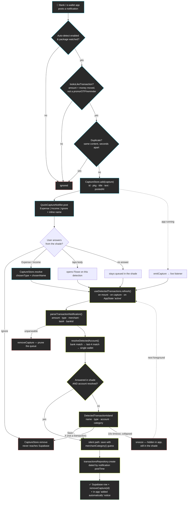
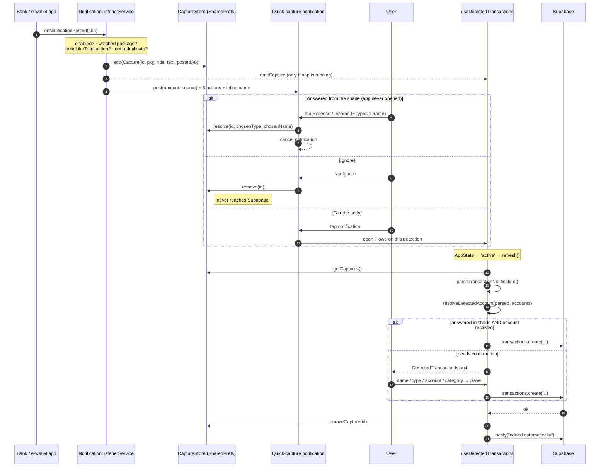
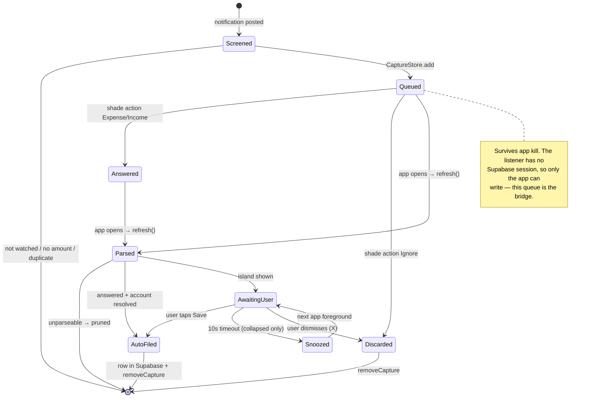

# Flowe — Outside-App Transaction Detection

How a payment made **outside Flowe** (a bank or e-wallet app notification) becomes a
transaction row, with or without the user ever opening the app.

**Android only.** iOS gives no app a way to read another app's notifications, so
`FloweNotifications.isAvailable` is `false` there and the whole flow is inert.

| Piece | Where |
|---|---|
| Notification listener service | `modules/flowe-notifications/android/.../TransactionNotificationListenerService.kt` |
| On-device capture queue | `.../CaptureStore.kt` |
| Quick-capture notification + actions | `.../QuickCaptureNotifier.kt`, `.../QuickCaptureReceiver.kt` |
| JS bridge | `modules/flowe-notifications/index.ts` |
| Orchestration hook | `src/hooks/useDetectedTransactions.ts` |
| Parsing / matching | `src/utils/parseTransactionNotification.ts`, `src/utils/resolveDetectedAccount.ts` |
| Account matching rules | `src/utils/accountMatching.ts` (shared by the resolver and the settings screen) |
| In-app confirm UI | `components/home/DetectedTransactionIsland.tsx` |
| Watched apps | `constants/notificationSources.ts` |
| Settings screen | `app/(main)/settings/auto-detect.tsx` |

## 1. Flow Overview

## 2. End-to-End Sequence

## 3. Lifecycle of One Capture

## Design Notes

- **The queue is the bridge.** The listener service runs with no signed-in Supabase
  session, so captures live in `SharedPreferences` until the app next runs and flushes
  them. Nothing is lost if the phone reboots or Flowe is force-stopped.
- **Loose native screen, authoritative JS parse.** Kotlin asks three things: is there a
  ringgit amount, does the text say money actually moved, and does it read as marketing?
  An amount alone is the shape a promo, a fee schedule and a balance reminder all share,
  so it is never enough. Type, merchant, last-4 and bank all come from
  `parseTransactionNotification.ts`, which is a pure function, unit-tested, and updatable
  via OTA without a native rebuild — so the native list stays the looser of the two.
- **No detection without somewhere to put it.** Settings → Auto-detect will not enable
  the feature, or watch an app, unless the user holds an account it could file into: the
  master toggle prompts them to add an account, per-app toggles are disabled, and an app
  whose account is later deleted is dropped from the watch list.
- **Last 4 digits are the only account tiebreaker.** A bank app's alert names the bank
  but the user may hold several accounts there, so the digits are editable in three
  places — onboarding, the account's edit sheet, and Settings → Auto-detect — and
  `resolveDetectedAccount` treats them as decisive, including refusing an account whose
  stored digits contradict the alert.
- **Transaction time is `sbn.postTime`,** not when Flowe read it — the row is dated when
  the payment actually happened.
- **Never guess an account.** `resolveDetectedAccount` returns `undefined` when the bank
  and last-4 don't pin one row (or the user has several wallets); the user picks instead,
  because a wrong guess silently moves the wrong balance.
- **Dismiss ≠ snooze.** The island's X discards the detection for good; the 10s timeout
  only hides it — the Android notification is still in the shade, and the detection is
  offered again on the next foreground.
- **The notification does not auto-cancel.** Opening Flowe on a detection isn't the same
  as filing it; only saving or dismissing cancels it.
