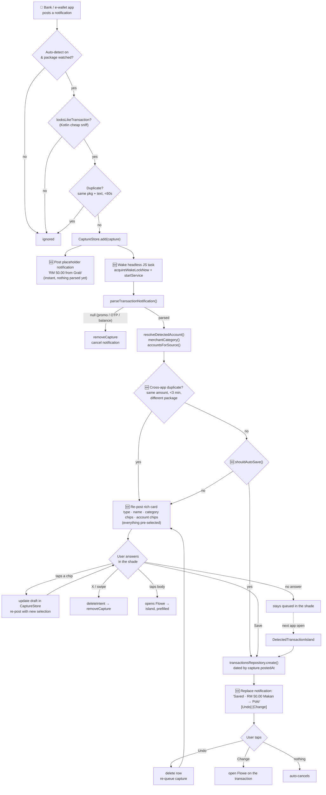

# Flowe — Auto-Save Flow (planned)

The target flow for outside-app transaction detection: **save automatically by
default, ask only when something is genuinely uncertain.**

Companion to `Flowe_AutoDetect_Flow.md`, which documents what is built today.
Everything marked 🆕 below does not exist yet.

| Piece | Where |
|---|---|
| Notification listener (Android) | `modules/flowe-notifications/android/.../TransactionNotificationListenerService.kt` |
| On-device capture queue | `.../CaptureStore.kt` |
| Quick-capture notification | `.../QuickCaptureNotifier.kt`, `.../QuickCaptureReceiver.kt` |
| 🆕 Headless JS task service | `.../FloweSaveTaskService.kt` + a custom RN entry |
| Parsing / matching | `src/utils/parseTransactionNotification.ts`, `resolveDetectedAccount.ts`, `accountMatching.ts` |
| Category guess | `src/utils/merchantLogo.ts` → `merchantCategory()` |
| 🆕 Auto-save rule | `src/utils/shouldAutoSave.ts` |
| Orchestration | `src/hooks/useDetectedTransactions.ts` |
| In-app confirm UI | `components/home/DetectedTransactionIsland.tsx` |

## 1. End-to-end flow



## 2. The auto-save rule

```ts
function shouldAutoSave(parsed, accountId, category) {
  if (!accountId) return false;             // resolveDetectedAccount() gave up
  if (!parsed.merchant) return false;       // the alert never named who
  if (!parsed.typeConfident) return false;  // debit AND credit words matched
  if (parsed.type === 'expense' && !category) return false;  // unknown merchant
  return true;
}
```

| Condition | Fails when | Example |
|---|---|---|
| `accountId` | wallet alert + more than one wallet account; last-4 missing or unmatched | Grab, holding both Polo and Setel |
| `merchant` | `findMerchant()` is deliberately conservative and found nothing | terse bank SMS-style alert |
| `typeConfident` | both a debit and a credit hint matched | "RM20 debited, payment received by merchant" |
| `category` | `merchantCategory()` returns `undefined` for an unknown name | a shop not in the merchant list |

Income skips the category test — `save()` only sets a category for expenses.

## 3. Why the notification is posted twice

The authoritative parse lives in TypeScript on purpose (unit-tested, updatable
without a native rebuild), so Kotlin cannot fill the card in at post time. The
flow therefore posts a minimal card immediately and re-posts the same
notification id once the headless task has parsed it — the card appears
instantly, then fills itself in a beat later.

Starting a service from the listener is permitted because the process is
already alive (the listener is bound by the system); a `PendingIntent` fired
from a notification action additionally grants a temporary allowlist window.
**Verify both on device early** — everything else depends on it.

## 4. Rich card layout (the "ask" path)

`NotificationCompat.DecoratedCustomViewStyle()` + `setCustomBigContentView()`,
≈252 dp budget:

```
[✨] −RM 50.00 · Grab · 2:05 pm
[ Expense ] [ Income ]            ← pre-selected from parsed.type
Makan                             ← TextView (RemoteViews has no EditText)
[🍔 Food & Drink] [🚗] [🧾] [🛍️]   ← pre-selected from merchantCategory()
[ Polo ] [ Setel ]                ← accountsForSource(), pre-selected if resolved
[         Save RM 50.00         ]
```

Constraints that shaped it:

- **No `EditText`** in RemoteViews — the name is displayed, not edited. Tap the
  body to rename in the app.
- **No horizontal scrolling** — cap at 4 chips per row, rest behind "More…".
  `accountsForSource()` usually returns 1–3, so this rarely bites.
- Custom views are **incompatible with Android 16 Live Updates**, so this card
  is a normal notification in the stack, not pinned like a media player.

## 5. Change list

| # | Change | Where | Status |
|---|---|---|---|
| 1 | `typeConfident` + `packageId` on the parse result | `parseTransactionNotification.ts` | ✅ done |
| 2 | `shouldAutoSave()` + cross-app duplicate window | `src/utils/shouldAutoSave.ts` | ✅ done |
| 3 | Pinned / learned default account per source | `resolveDetectedAccount.ts`, `src/lib/detectPreferences.ts`, Settings → Auto-detect | ✅ done |
| 4 | Auto-save wired into the detection flow | `src/hooks/useDetectedTransactions.ts` | ✅ done |
| 5 | Account / category snapshot pushed to native | module API + `CaptureStore` | 2h |
| 6 | Headless JS task: parse → resolve → auto-save | `AutoFileTaskService.kt`, `autoFileTask.ts`, `index.js` | ✅ done |
| 7 | Saved / Undo notification | `QuickCaptureNotifier.kt` | 2h |
| 8 | Rich RemoteViews card for the ask path | `QuickCaptureNotifier.kt` + layout XML | 1–2d |

Steps 1–4 are pure TypeScript with unit tests and no native rebuild, so the
auto-save rule can be judged against real detections before any notification
work starts. Until step 6 lands, a detection is still written to Supabase the
next time Flowe runs, not at the moment the alert arrives.

### Where the default account comes from

Two ways, one store (`src/lib/detectPreferences.ts`, device-local):

- **Pinned** — Settings → Auto-detect, tapping an e-wallet row (or the "when an
  alert prints no digits" chips on a bank row).
- **Learned** — filing a detection by hand from the island records the account
  for that app, but only when Flowe had no answer of its own. An explicit pin is
  never overwritten by a one-off choice.
