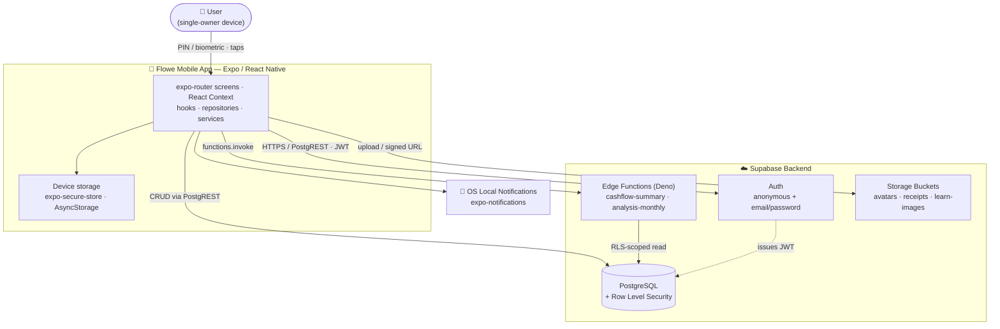
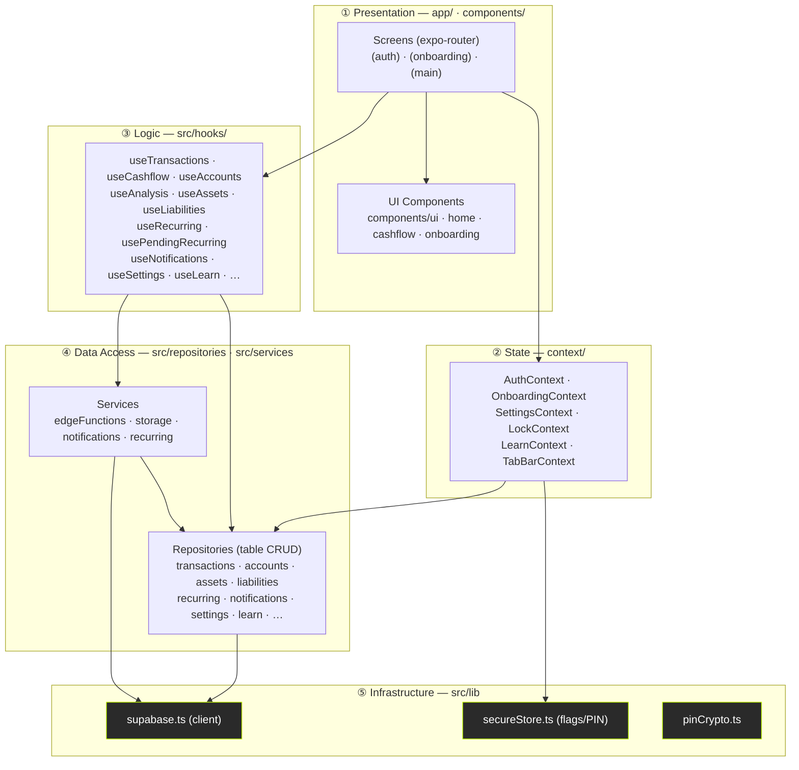
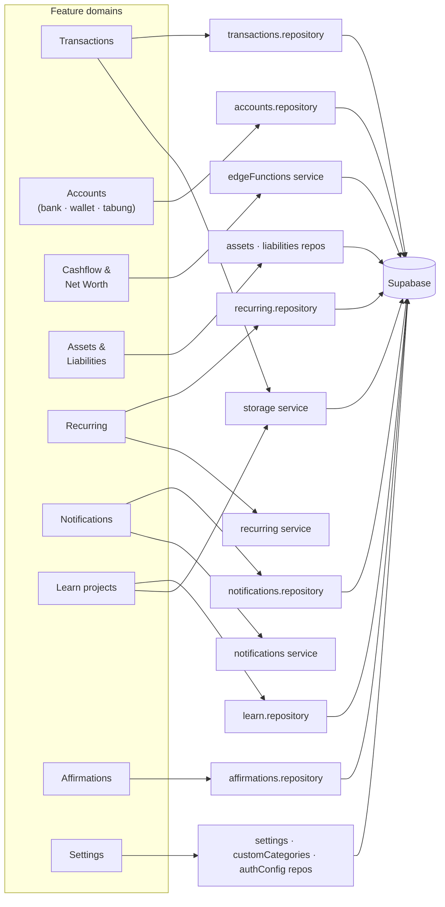
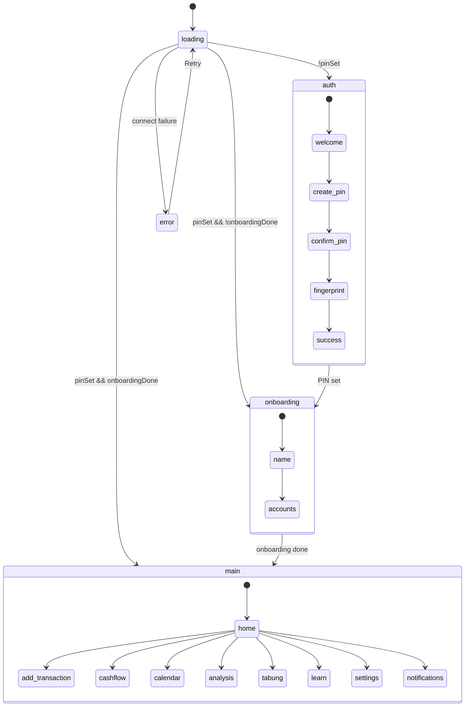
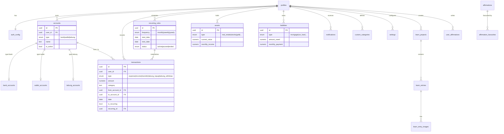
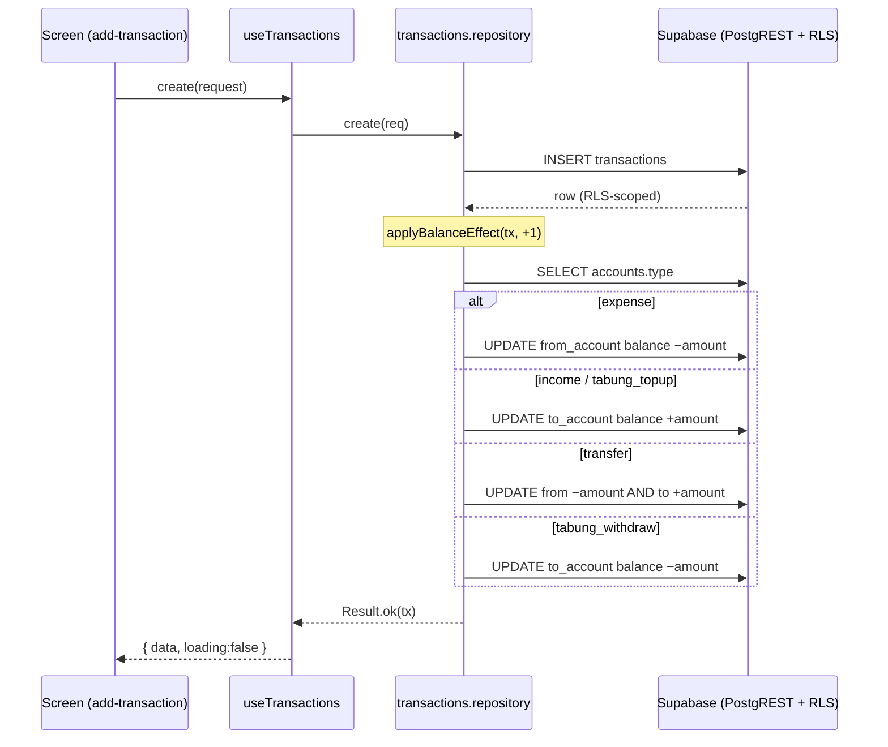
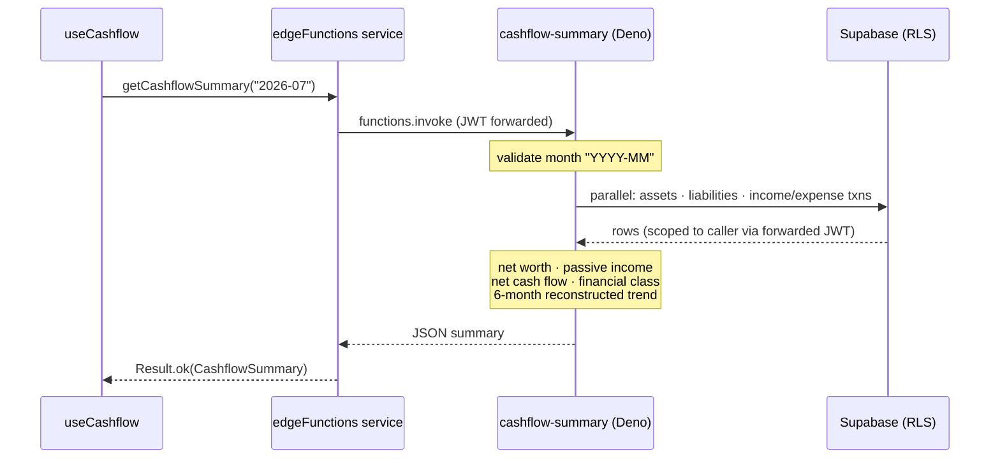
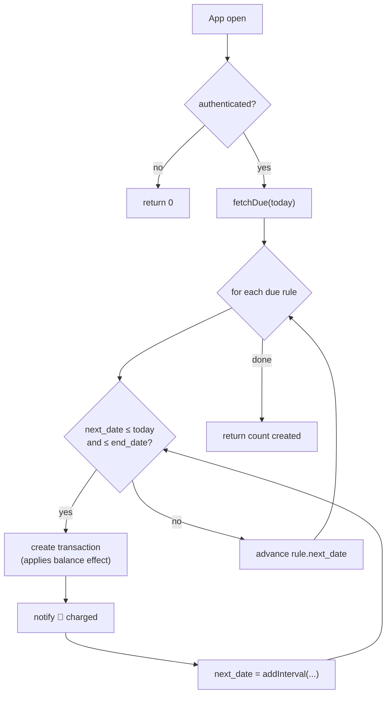
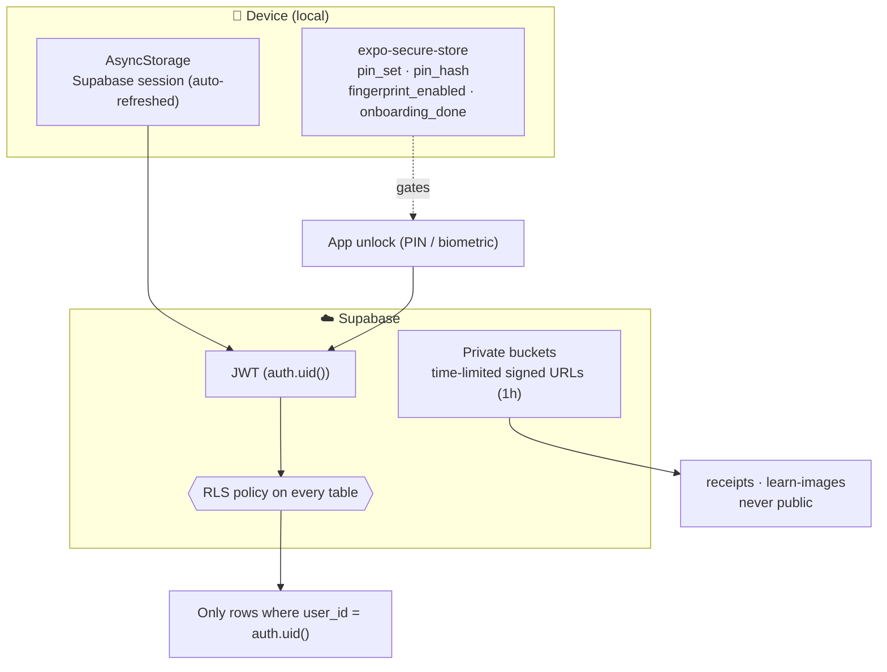

# Flowe — Software Architecture

Flowe is a **dark-mode-only personal finance tracker** for iOS/Android, built with Expo (React Native 0.81, React 19) and backed by Supabase (Auth, PostgreSQL + Row Level Security, Edge Functions, Storage).

The client enforces a strict, one-directional layering:

> **Screen → Context/Hook → Repository/Service → Supabase client → Supabase**

UI components never import the Supabase client directly. Data-access functions return a `Result<T, E>` (never throw); hooks unwrap that into `{ data, loading, error }`.

---

## 1. System Context (C4 Level 1)

**Key characteristics**

- **Single-user-per-device.** A local PIN (and optional biometric) gates the app; the Supabase session is anonymous by default, so the app is usable offline-first and without an email account.
- **Two API shapes:** direct table CRUD (PostgREST via repositories) + 2 Edge Functions for computed aggregates that would be expensive/awkward on-device.
- **Security is centralized in the database.** Every table read/write is scoped to `auth.uid()` by RLS — the client cannot query another user's rows even if it tried.

---

## 2. Client Layered Architecture

| Layer | Directory | Responsibility | Rule |
|---|---|---|---|
| Presentation | `app/`, `components/` | Screens & pure UI | May use Context + Hooks; **never** touches Supabase |
| State | `context/` | Cross-screen state (auth, lock, settings, onboarding draft) | Calls repositories |
| Logic | `src/hooks/` | Fetch/mutate + `{ data, loading, error }` | Owns loading/error state |
| Data Access | `src/repositories/`, `src/services/` | Supabase CRUD, Edge Functions, Storage | Returns `Result<T, E>`; **only** layer importing `supabase` |
| Infrastructure | `src/lib/` | Client singleton, secure store, PIN hashing | — |

---

## 3. Module Map

Repositories (13) map ~1:1 to table groups; services (4) wrap non-CRUD concerns: `edgeFunctions` (computed aggregates), `storage` (image upload + signed URLs), `notifications` (write row + fire OS banner), `recurring` (materialize due rules into transactions).

---

## 4. Routing & Auth Gate

`app/_layout.tsx` is a three-state gate driven by **local** flags (`expo-secure-store`), not by the network session. On launch it ensures an anonymous Supabase session exists, then routes:

- **`(auth)`** — first-run PIN setup (+ optional biometric). Writes `pin_set` flag locally and `pin_hash` to both secure store and the `auth_config` table.
- **`(onboarding)`** — capture display name and initial accounts (bank / wallet / tabung). `OnboardingContext` holds the draft until committed.
- **`(main)`** — the protected app. `LockContext` re-locks on background/auto-lock timeout; `LockOverlay` demands PIN/biometric to resume.

`refreshGate()` is exported so any flow (e.g. finishing onboarding, resetting data) can force the gate to re-evaluate.

---

## 5. Data Model

**Notes**

- `accounts` is a shared header; type-specific balances live in `bank_accounts.current_balance`, `wallet_accounts.current_balance`, and `tabung_accounts.saved_amount`.
- Account balances are **maintained by the client**, not the DB. Every transaction write applies a signed delta to the relevant balance table (see §6) — edits reverse the old effect before applying the new one.
- No historical net-worth table exists; the cashflow trend is reconstructed from `date_acquired` / `created_at` cutoffs inside the Edge Function (see §7).

---

## 6. Flow — Create Transaction (with balance effect)

Repositories keep account balances consistent by applying a signed delta after each write. Edits reverse the old impact, then apply the new; deletes reverse.

The balance-effect helper (`applyBalanceEffect` + `adjustAccountBalance`) is the single source of truth for how each `TransactionType` moves money, reused by create, `updateWithBalance`, and `delete`.

---

## 7. Flow — Cashflow Summary (Edge Function)

Aggregation runs server-side so the client fetches one computed payload rather than pulling every asset/liability/transaction.

The function re-creates a Supabase client with the caller's `Authorization` header, so RLS still applies inside the function — it can never read another user's data. `analysis-monthly` follows the same pattern for chart data + category breakdown.

---

## 8. Flow — Recurring Rules on App Open

`processDueRecurring()` runs best-effort at startup: it materializes every due occurrence into real dated transactions (catching up missed periods in order) and rolls each rule's `next_date` forward. It is idempotent — re-running the same day is a no-op — and failures never block startup.

A parallel path (`usePendingRecurring` + `PendingRecurringModal`) can instead surface due occurrences for **manual** approve/skip via `approveRecurring` / `skipRecurring`, rather than auto-posting.

---

## 9. Security & Local Storage

- **App access** is gated locally by a hashed PIN (`pinCrypto` + `expo-secure-store`) and optional biometric — independent of network state.
- **Data access** is gated by RLS: the JWT's `auth.uid()` scopes every query and Edge Function call.
- **Files:** `avatars` is public-URL; `receipts` and `learn-images` are private and served via 1-hour signed URLs (batch-signed where possible).

---

## 10. Tech Stack

| Concern | Choice |
|---|---|
| Framework | Expo SDK 54 · React Native 0.81 · React 19 |
| Routing | expo-router 6 (file-based) |
| Styling | NativeWind 4 (Tailwind) — dark-mode only, accent `#C5FF00` |
| Animation | react-native-reanimated 4 + react-native-worklets |
| State | React Context (+ zustand available); per-feature hooks |
| Backend | Supabase — Auth, PostgreSQL + RLS, Edge Functions (Deno), Storage |
| Local storage | expo-secure-store (secrets/flags) · AsyncStorage (session) |
| Notifications | expo-notifications (local only) + `notifications` table |
| Icons / charts | lucide-react-native · react-native-svg |
| Testing | Jest + @testing-library/react-native |

---

## Architectural Principles (summary)

1. **Strict unidirectional layering.** Screen → Context/Hook → Repository/Service → `supabase`. UI never imports the client.
2. **`Result<T, E>` everywhere.** Data functions return typed results; hooks own loading/error; nothing throws across a layer boundary.
3. **Thin server, targeted compute.** Direct CRUD by default; Edge Functions only for aggregates (net worth, trends, analysis) that are cheaper server-side.
4. **Database-owned authorization.** RLS on every table (and forwarded into Edge Functions) is the real security boundary; the local PIN is UX/device protection.
5. **Idempotent, best-effort background work.** Recurring processing catches up missed periods and can safely re-run on every open.
6. **Client-maintained balances.** A single balance-effect function defines how each transaction type moves money, reused across create/update/delete.
